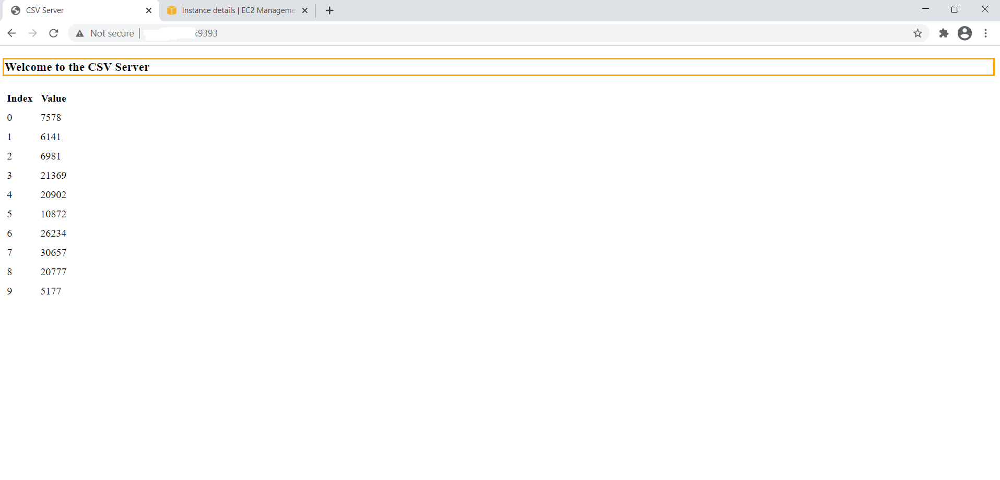
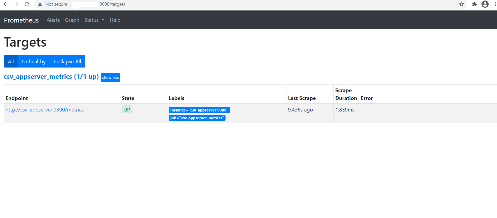
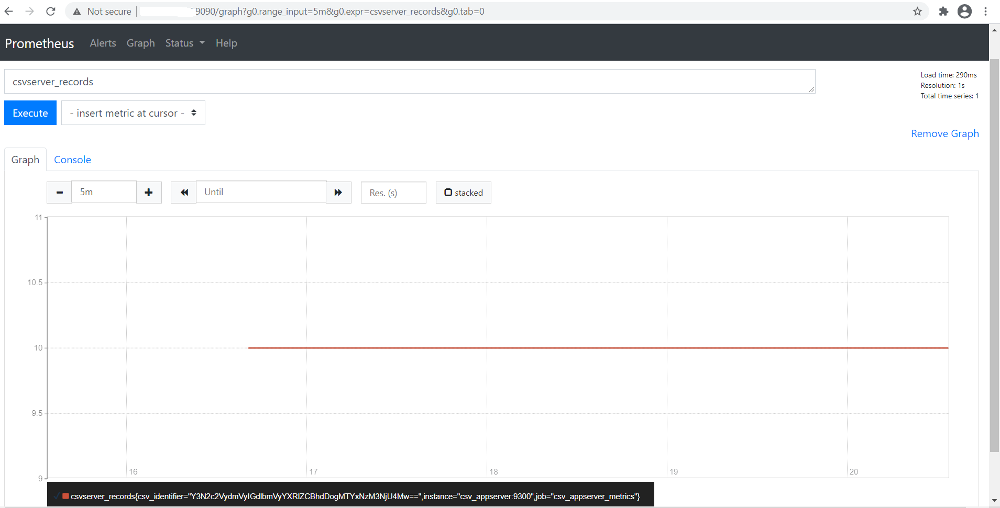

# The csvserver Assignment Solution

This repository contains code samples, files & screenshots of the solution I have prepared for the csvserver assignment.

> **NOTE**: Please refer **Solutions** directory for individual code files as well as output & log files.

## Test Environment

All the code samples in this solution were tested on:
 + Platform: AWS
 + OS: Ubuntu 20.04-amd64 AMI
 + Docker Version 20.10.5, build *55c4c88*
 + Docker Compose Version 1.28.6, build *5db8d86f*
 + Prometheus Version 2.22.0


**NOTE** I have used *Terraform* to provision the test environment on AWS.
It can be reproduced by running *main.tf* file provided in the repository.

**Prerequisites**

1. In order to avoid hard-coding AWS Credentials in the .tf file, have those exported as environment variables prior to running the .tf code.

 ```bash
 $ export AWS_ACCESS_KEY_ID="YOUR_ACCESS_KEY"
 $ export AWS_SECRET_ACCESS_KEY="YOUR_SECRET_ACCESS_TOKEN"
 ```
2. To log in to the EC2 instance, we need a key pair. I am using a local key pair here.
The keys should be located in the same folder as your Terraform file, and be named `mykey.pub`, and `mykey`.
Keys can be generated on Linux by:

```bash
$ ssh-keygen -t rsa
Generating public/private rsa key pair.
Enter file in which to save the key (/home/dev/.ssh/id_rsa): mykey
Enter passphrase (empty for no passphrase):
Enter same passphrase again:
Your identification has been saved in mykey.
Your public key has been saved in mykey.pub.
```  
3. Now you can provision your VM by:

```bash
terraform init
terraform plan
terraform apply
```


## Part 1

1. Run the container image `infracloudio/csvserver:latest` in background and check if it's running.

  ```docker
   docker run -d infracloudio/csvserver:latest
  ```
2. If it's failing then try to find the reason, once you find the reason, move to the next step.

```bash
Initial run fails, as there is no volume binding as expected by csvserver.
Confirmed by checking the logs with "docker logs".

error while reading the file /csvserver/inputdata: open /csvserver/inputdata: no such file or directory
```

3. Write a bash script `gencsv.sh` to generate a file named `inputFile` with contents of comma separated values with index and a random number.

```bash
Wrote a bash script named "gencsv.sh". Can be viewed from the "Solutions" directory.
```

4. Run the container again in the background with file generated in (3) available inside the container (remember the reason you found in (2)).

```docker
docker run -d --name 'csv-appserver' -v "$(pwd)"/inputFile:/csvserver/inputdata infracloudio/csvserver:latest
```
  5. Get shell access to the container and find the port on which the application is listening. Once done, stop / delete the running container.

```docker
docker exec -it csv-appserver bash

netstat -tulpn | grep LISTEN   -- Returns Port 9300 used by app.
```

  6. Same as (4), run the container and make sure,
     - The application is accessible on the host at http://localhost:9393
     - Set the environment variable `CSVSERVER_BORDER` to have value `Orange`.

```docker
docker run -d -p 9393:9300 \
--name 'csv-appserver' \
-e CSVSERVER_BORDER='Orange' \
-v "$(pwd)"/inputFile:/csvserver/inputdata infracloudio/csvserver:latest
```



> **Note**: Files `gencsv.sh`, `inputFile`, `part-1-cmd`, `part-1-output`, `part-1-logs` are present in the *Solution* directory.


## Part 2

0. Delete any containers running from the last part.
```bash
docker stop csv-appserver
docker rm csv-appserver
```

1. Create a `docker-compose.yaml` file for the setup from part I.

```bash
Created a 'docker-compose.yml', can be referenced from Solution directory.
```


2. One should be able to run the application with `docker-compose up`.

```bash
docker-compose up -d
```

## Part 3

  0. Delete any containers running from the last part.

```bash
docker stop csv-appserver
docker rm csv-appserver
```
  1. Add Prometheus container (`prom/prometheus:v2.22.0`) to the docker-compose.yaml form part II.

```bash
Added prometheus service to the 'docker-compose.yml'
```

  2. Configure Prometheus to collect data from our application at `<application>:<port>/metrics` endpoint. (Where the `<port>` is the port from I.5)

```bash
Added 'prometheus.yml' configuration file in Solution directory.
```
  3. Make sure that Prometheus is accessible at http://localhost:9090 on the host.



  4. Type `csvserver_records` in the query box of Prometheus. Click on Execute and then switch to the Graph tab.


